# ImageToInsulin Estimator

## Problem definition

All of those that have type 1 diabetes (over 20 million people worldwide, [1](https://pro.aace.com/disease-state-resources/diabetes/depth-information/burden-type-1-diabetes
)), and certain people with type diabetes need to manually inject insulin for each meal they eat, based on the amount of carbohydrates (carbs) in the meal. They therefore either need to learn the carb percentages of many different foods, or to look them up by hand each time they eat something. This is obviously very time consuming and difficult. We propose a computer vision based solution, where the carb percentages can be calculated from a photo of a meal. We also calculate an estimated insulin dosage if the users input the weights of the different foods and their insulin factor. Our solution can therefore speed up insulin dosage calculation and does not require any manual calculation using the insulin factor, which makes the day-to-day life of those with diabetes easier.

There have been other approaches to this problem, such as fitness apps that attempt to find nutritional information from an image. These applications are more focused on general nutritional information and are therefore not as suited for those with diabetes, as they for example do not incorporate calculating insulin using an insulin factor [2](https://www.caloriemama.ai/).

There has also been scientific research that explores the topic of estimating carb amounts based on images. Most of these try to use volume approximation methods to get exact nutrition information from a meal, and are only research papers rather than easily accessible services as ours [3](https://ieeexplore.ieee.org/document/7520547), [4](https://ieeexplore.ieee.org/document/6701615), [5](https://news.mit.edu/2022/all-one-diabetes-insulin-0120).

### System design

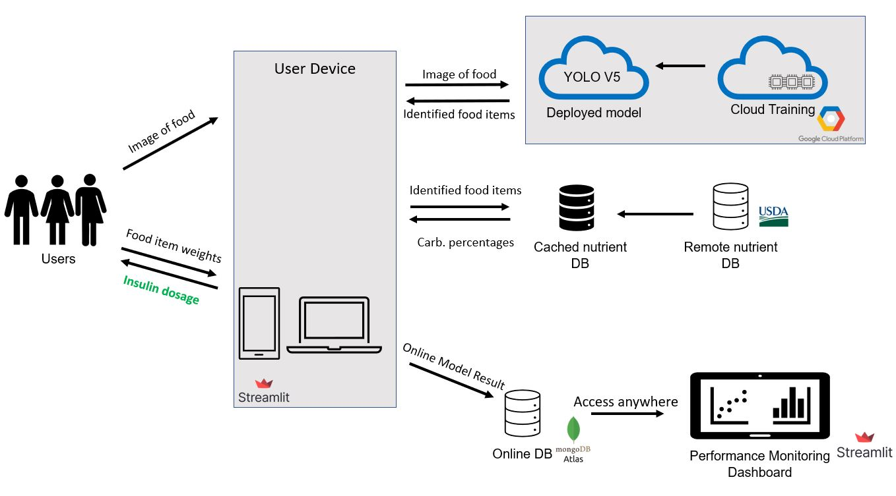

An overview of the system can be seen in the above figure. The flow starts with the user inputting an image of food into their device. We have created this frontend as a website using [Streamlit](https://streamlit.io/). The UI can be seen in detail in the Application demonstration section, where we also motivate why we host our application as a website. The reason why we choose to use Streamlit is because of its unparalleled simplicity of bringing a data-driven application to frontend.

The next step is that the food image is passed to the deployed model. The model training and deployment are done in [Google Cloud](https://cloud.google.com/). The front-end application passes the uploaded image to the deployed model using an endpoint we have made accessible on Google Cloud, which returns the predicted food items. Deployment on cloud was an easy choice: we want our service to be accessible by whomever, whenever. Google Cloud in particular was mostly motivated by the fact that we got GCP credits with the course.

Using the predicted food item labels as input, we then query a nutrition database to get the carb percentages of the identified foods. We get this information from the United States Department of Agriculture ([USDA](https://fdc.nal.usda.gov/api-guide.html)), which has a free and extensive database with nutrition information. However, querying their database adds additional unnecessary latency to the application. What we instead choose to do is to cache the response to all the labels in our dataset. We store these in a JSON-file, which has a negligible size.

At the same time as we gather the carb percentages, we also ask the users to verify if the identified foods have been identified correctly, and to add the weight of each of the identified foods. Based on their response, we can calculate the insulin dosage using the following formula:

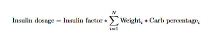

Lastly, we gather data from the interaction with the user, which we save in a cloud NoSQL database called [MongoDB Atlas](https://www.mongodb.com/atlas/). The data in this database can then be accessed from anywhere to launch a performance monitoring dashboard, that is written in Streamlit, that can showcase the online performance. MongoDB Atlas was very convenient to set up, and suits our needs very well. It has enough storage capacity, and it is fast and easy to use. Streamlit was also very well suited for showcasing what we want to show. We wanted the Streamlit script to be able to be launched from anywhere, so that many different stakeholders could access it, by still using the same source of truth for the visualization, which is why we chose to do it this way. It would also have been possible to launch it as a website that people could access. The approach of having each stakeholder launch it locally enables them to potentially modify their local dashboard file, if they are interested in looking at some particular aspect of the online data, which we think is very beneficial.

### Machine learning component

##### Dataset

We use the [UECFOOD 100 dataset](http://foodcam.mobi/dataset.html). The dataset contains about 100 different foods and about 100 images of each food. The foods consist of many japanese dishes (ramen noodle, miso soup) but also some western dishes (croissant, hamburger). Many images have several different foods in them.

#### Model iterations

Our approach for the modeling is to use an objection detection model. The reason for this is that we want to be able to identify multiple food items in a given meal. The bounding boxes that the object detection model generates are not of direct interest to us in this project, as we are simply interested in the identified objects. They do open up possibilities to possibly estimate volume if the application was extended.

### First iteration - MVP Yolov2 Pretrained

For the MVP, we restored to using a pretrained model, that we got from Benny Cheung, the author of this [blog post](http://bennycheung.github.io/yolo-for-real-time-food-detection). This model is a Yolov2 (You Only Look Once) object detection model. We used this approach to simply get a functioning MVP out as soon as possible. However, because we did not know the training, validation and testing splits, we could not get any meaningful evaluation out of this model. Our empirical evaluation indicated that the model could be improved, so we instead put our efforts into training our own model.

###### Second iteration - Yolov5 Model Size Comparison

In order to develop our own model, we used YOLOv5 which aims to be faster and more accurate than the version 2 object detection model. We used transfer learning to train the model for our use case, the pretrained weights were on COCO dataset and using a batch size of 16 (due to VRAM limitation), 300 epochs we were able to hit 60% Precision (as shown in table below). We trained three different versions of the model, nano, small and medium. By training different model sizes, we can compare the performance in terms of precision, recall and latency, as discussed in the System Evaluation section.

We wanted different options for our system, we use 3 different model sizes of YOLOv5. Our training set ~10,200 images and a test set ~ 1,200 images. We did not do any hyperparameter tuning to save time and compute cost, hence did not use a validation set. The result on the test set was the following:
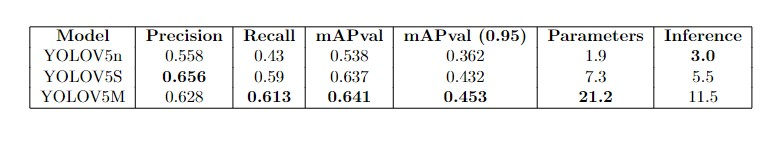

## System evaluation

###### Online System Evaluation

For the online evaluation, we have built a monitoring dashboard that tracks how the system is performing. In order to have some data to showcase in the dashboard, manually input 90 images from the test set for each of the model sizes we trained for.

In the monitoring dashboard, there is an option to choose between either a Developer’s View or Business' View.
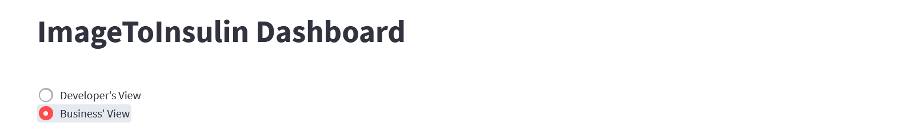

In Business’ View there is quick info of the performance of the latest 10 samples.
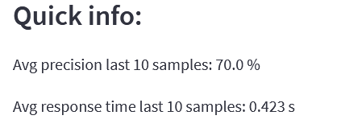

There are also graphs of Precision and Latency over time, as well as histograms such as this one
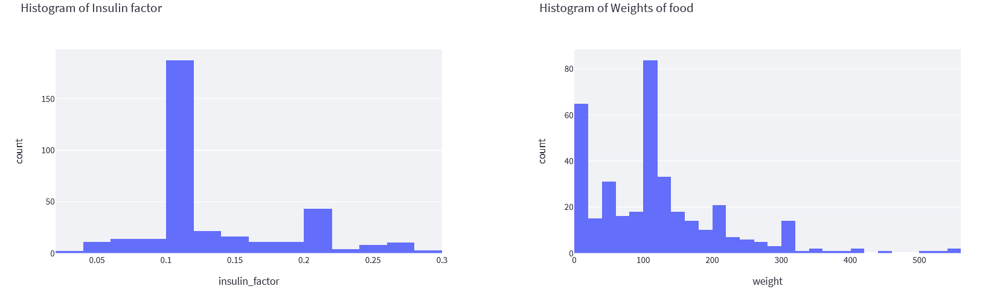

In the developer's view, there is more detailed information about the latency and precision of the different model sizes that we have trained.

Based on what we have seen in all of these plots, the system performs well compared to what we expect.

We also choose to dive deeper into one output in particular, the insulin dosage. We plot this in a histogram, which yielded the following result:
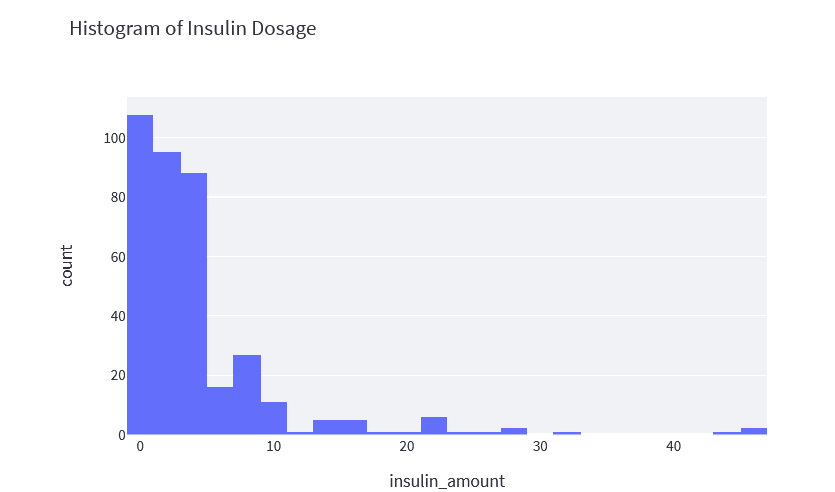

In our analysis, we then select some of the entries with the highest insulin dosage amount. By studying these entries in particular, we could find that most of the high insulin values were created by very big portions of pizza combined with a high insulin factor. We could manually verify that these calculations actually were correct. However, we also found a bug where we got a too high carb percentage value for ramen noodles from our database. Upon further inspection, we realized that we got the uncooked ramen noodle value rather than the cooked value, which has a much higher carb percentage.

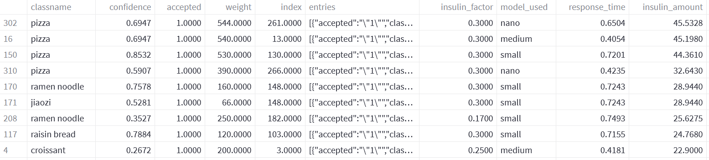

AI System Evaluation vs Manual Legacy Evaluation:
An additional test we did of our whole system was an end-to-end test, with a comparison to a calculation done without the use of our webapp.

We consider the following input image and food weights:
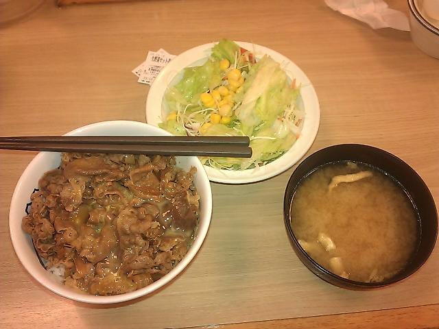
- Green Salad: 60
- Miso soup: 40
- Beef bowl: 300 (whereof rice 150g)

Our system gives the output:
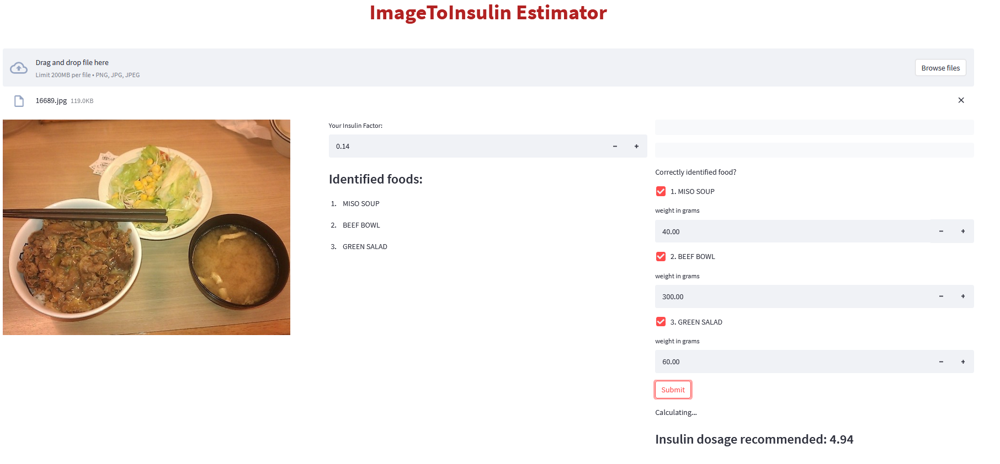

With the estimated insulin dosage being 4.94 units.

We also asked someone with diabetes to do this by hand. Their approach was to mainly consider rice, which will be by far the ingredient that adds by far the most amount of carbs. They used another (Swedish) site to find the carb percentage of rice.
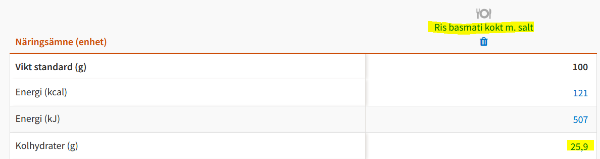

They then calculated the amount of carbs given the rice weight and the carb percentage.
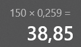

The next step was that they arbitrarily added 10 grams of carbs for the beef sauce and the corn, without considering these in too much detail. This meant that the total amount of carbs were considered as 49 grams.

Finally, this user had an insulin pump, and input the carb amount there
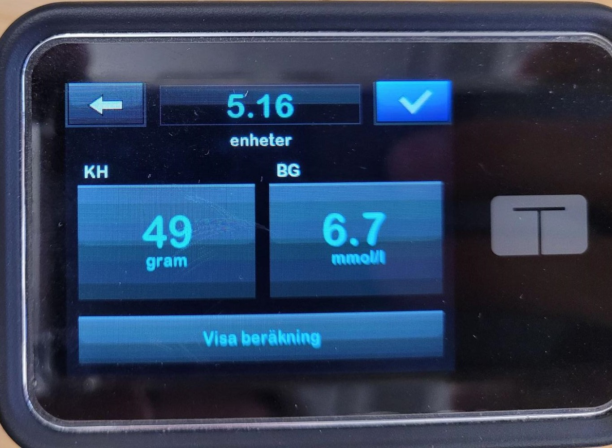

Which yielded the insulin dosage 5.16. This value is close to the value of our application (4.94) and serves as a reality check that our application works as intended for this example.

###### Limitations

We have some inherent limitations to our system, based on the external resources we use. One limitation is that we can only predict the foods that we have been able to train on in our dataset. Additionally, we needed to make sure that all foods in our dataset have good data from the USDA nutrient database. After checking this, we found that 7 labels from the dataset did not have a good counterpart in the database. These were dishes such as “jiaozi” and “nanbanzuke” that might not be common in the US.

### Application demonstration

The steps that a user takes when interacting with the application are the following:
1. The user uploads an image to the website
2. The insulin factor can be entered into the website. This should be         calculated by the person with diabetes together with a nurse
3. The user accepts all images that are found in the image. This steps verifies that the foods that have been found are correct
4. The next step is then to add the weights of all the different food items
5. The user presses submit, and the estimated insulin dosage is displayed

These steps can be seen in the following video:
https://youtu.be/rAwQsCBgmC4

Our main use case is for people with diabetes to use our application whenever they eat something. As such, it will be easiest for them to use it through their phone. Our first approach was therefore to try and build a mobile phone application. This however turned out to be extremely difficult given that we did not have any previous experience developing mobile phone applications, which is why we changed to a web application. A web application can also be accessed from a mobile phone, which means that the usability is not reduced by a very significant amount. We discuss this further in the Reflection section.

### Reflection

###### What worked well

Overall, we are quite pleased with the overall structure of our application. It feels like it has a reasonable flow of information, that is cloud-based and scalable. We are satisfied with the way we query nutrient information using our cached data, to reduce latency.

We are also satisfied with how MongoDB Atlas, Streamlit and Yolov5 have worked. They have been convenient tools that have enabled us to quickly build the product that we wanted.

###### What didn’t work well

The dataset that we used has not been great for our purposes. It contains quite a lot of data, but we have seen that there are cases where certain classes are missing. The foods are also centered around Japanese dishes, which are less common here in the US.

On a team level, we have been a bit hindered by the fact that we all live in different time zones. It would have been nice to have coworking sessions in real life and to coordinate meetings easier. Despite this, we have managed to work around this for the most-part and keep up quite efficient communication.

We spent a lot of time trying to build a mobile application, before changing to a web application. A mobile application has an even more appealing use case, but the difficulty of building it turned out to be too much, and we would rather focus on making the best possible ML system. Had we redone the project, we would not have spent so much time on the mobile application.

###### What would you add to your application

Two small improvements that could be added quite easily would be to save the images the users upload, so that we could eventually use them as training data. The main reason as to why we did not implement this right away is that we are training an object detection model, so we would need bounding box labels, which we do not get from the user interaction. It would also be beneficial to create the possibility for users to add food items that were not detected by the model. In part this would give us access to statistics of false negatives and additionally enable users to add them to the insulin calculation which would be good from a user experience point of view.

There are two big areas that would be very interesting to continue to work on if we would have had more resources. First, it would have been interesting to complete the development of the mobile application that we started to work on before we switched to the web application.

Our mobile phone application consisted of the following:
The user login page on the application that allows users to enter username and passwords, if their entries match with the record in the database, it will show a progress bar and redirect users to the main activity page. In the main activity page, there is a button with the name ‘Pick an image’ at the bottom of the screen. Once the user clicks on it, it will ask users whether or not they should have permission to access local or online images. If users deny the permission, they will be redirected to the login page, otherwise, they will need to specify whether to upload images locally or online. Once the image has been selected by the user, the main activity page will establish the connection to the model’s end point from google cloud and display a list of nutrients from the image on the main screen. Also, users will be able to input the corresponding amount of each nutrient and their insulin factors on this page.

With more time and ideally some previous experience with mobile development, we could have completed the application completely as an app. This would have made it easier to use, rather than users having to go on a website to use it.

Second of all, it would have been really interesting to further explore how we could have calculated the weight of the food from images alone. We thoroughly explored possibilities to do this at the start of the project and found that it is difficult to do it accurately using mathematical methods, but if we would have had the resources to create a dataset with food weights recorded, it could likely be achieved in a satisfactory manner.

### Broader Impacts

The intended use of our application is almost only for people with diabetes to check how much insulin they need to inject for a given meal. It could quite easily be extended to showcase more nutrition information, which would enable use for gym goers who want to count macronutrients as part of their diet for example. However, there is a lot more competition with regards to such apps, so it is not as relevant for us.

One very harmful use of the application would be if someone puts in unreasonable numbers, such as putting in 4000g instead of 400g. Either by mistake or if someone does this on purpose, and shows someone else the result. In order to catch these mistakes, we have put a warning if the insulin dosage is above 15 units, which is a high amount.

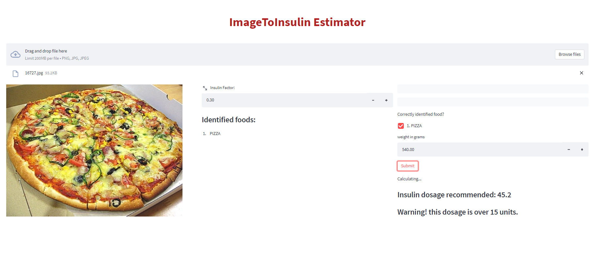

One possible misuse of the application would be if someone meaningfully adds bad data through user interactions. This could be especially bad if we choose to start to use the user input to train the model further, such as to estimate the weights of certain foods. Since we do not do this yet, it is not a problem at this moment in time. If we were to start using the data, we would need to keep track of suspicious amounts of uploads from certain users. There is also a need to track and remove outlying data points. Currently we do this by for example doing a reasonability check on insulin factor values, based on which values we know are reasonable.
